## MM4

# HTML / CSS

Note:
https://nclsndr.github.io/hetic-html-css-mm4-2019
---

## Who am I?

- [Nicolas André](https://twitter.com/nclsndr) — UX Engineer at <a target="_blank" href="https://www.chance.co">Chance</a>

---

# And you?

---

## About this cycle

#### 26 nov.
History, HTML/CSS basis, UI design, Let's code
#### 03 dec.
Responsive integration, CSS displays
#### 10 dec.
Web builders, CSS transitions & animations
---

<h1 style="color: #FFF;">Ready?</h1>

<!-- .slide: data-background="assets/ready.gif" -->

---

# 🧐

### Who is HTML?

---

### Some valid definition 

__HTML__ (HyperText Markup Language) is the most basic building block of the Web. It defines the meaning and structure of web content. [...]

by [Mozilla docs](https://developer.mozilla.org/en-US/docs/Web/HTML)

---

# 🤷‍♀️
### Ok, but why?

---

<h2 style="color: #FFF;">Back in 1969</h2>

<!-- .slide: data-background="https://media.giphy.com/media/3o7aD46cTjbkp0gT5e/giphy.gif" -->
---

<div>
  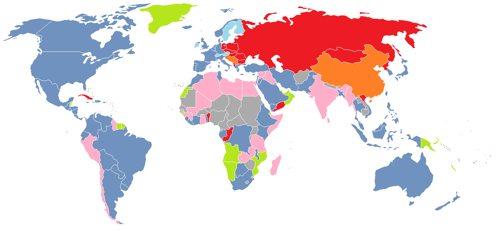
</div>

### 🇺🇸 👮‍♀️ 💬 ☢️ 💬 👨‍💼
---

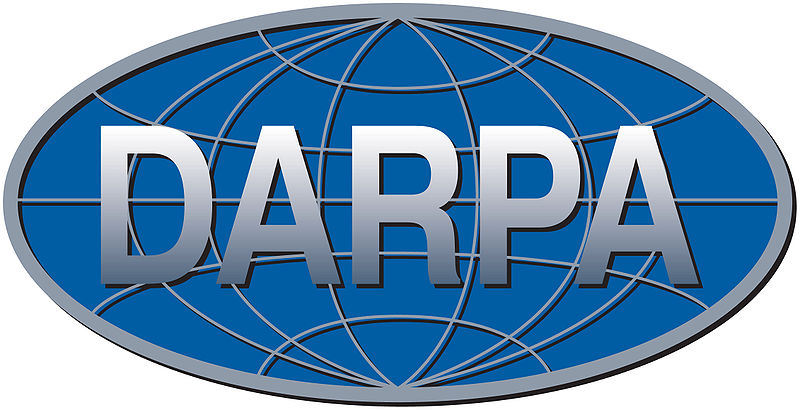

[Defense Advanced Research Projects Agency](https://www.darpa.mil/about-us/about-darpa) — since 1958
---
<div>
  
</div>

## SRI
[Stanford Research Institute](https://en.wikipedia.org/wiki/SRI_International) — since 1946

---
<div>
  
</div>

### [Douglas Engelbart](https://en.wikipedia.org/wiki/Douglas_Engelbart)

American engineer and inventor, and early computer and Internet pioneer

Founder of Augmentation Research Center (ARC) at SRI

---
<div>
  
  
</div>
<div>
  
  
</div>

### 🧑‍🏫 📺 💬 📺 🧑‍🏫

Note:
https://www.lib.utah.edu/digital-scholarship/arpanet/
https://en.wikibooks.org/wiki/The_Computer_Revolution/Networks/Internet

---
> The goal was to exploit new computer technologies to meet the needs of military command and control against nuclear threats, achieve survivable control of US nuclear forces, and improve military tactical and management decision making.

*— [Stephen J. Lukasik](https://en.wikipedia.org/wiki/ARPANET#Debate_on_design_goals), Director of DARPA (1967–1974)*

---
> The ARPANET was not started to create a Command and Control System that would survive a nuclear attack, as many now claim. [...]. Rather, the ARPANET came out of our frustration that there were only a limited number of large, powerful research computers in the country, and that many research investigators, who should have access to them, were geographically separated from them.

*— [Charles Herzfeld](https://en.wikipedia.org/wiki/ARPANET#Debate_on_design_goals), ARPA Director (1965–1967)*

---
### [Request For Comments](https://tools.ietf.org/html/rfc1)

<div>
  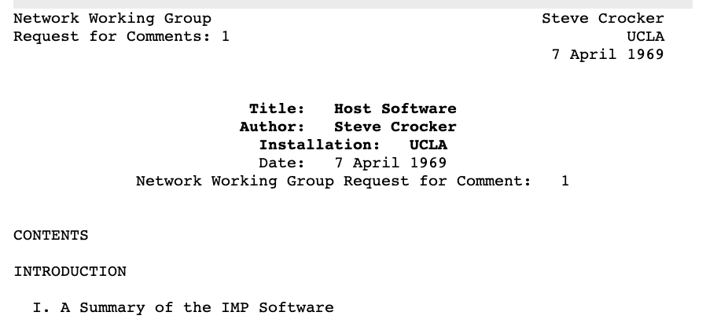
</div>

Applying scientific method for a collaborative definition of world wide standards

---
<div>
  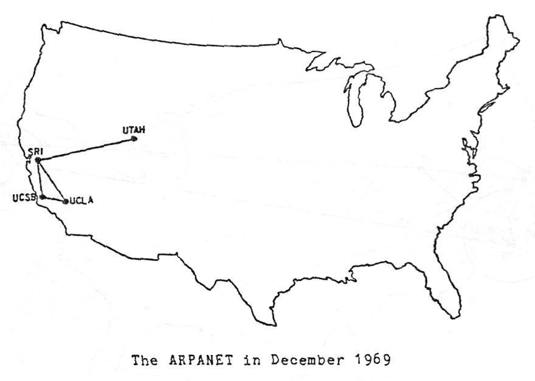
</div>

1969
---
<div>
  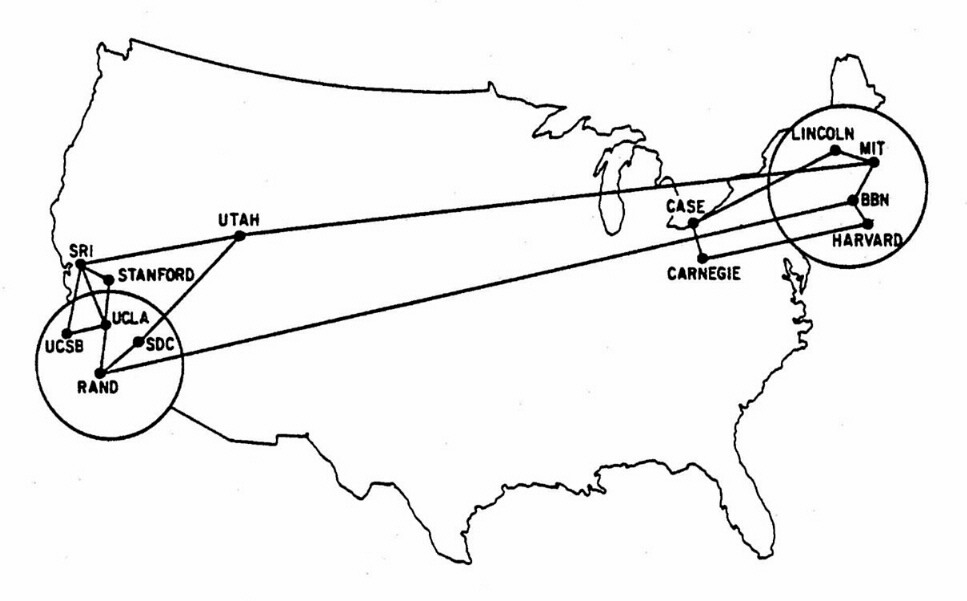
</div>

1970
---
<div>
  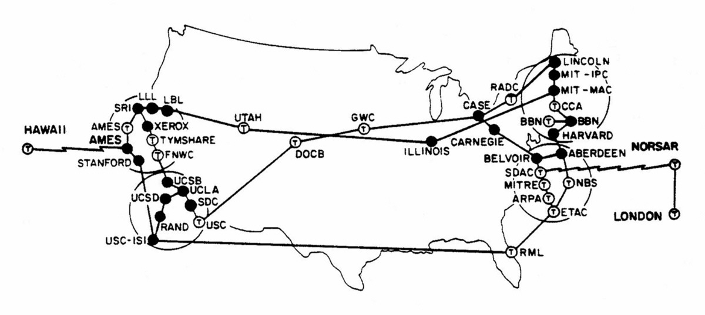
</div>

1973 - 

<a href="https://www.vox.com/a/internet-maps" class="source_link" target="_blank" >
source: vox.com
</a>

---
<!-- .slide: data-background="assets/twitter_wake_up.gif" -->
---

## Internet VS Web?

---

### RFC1122 - Internet Protocol Suite

<div>
  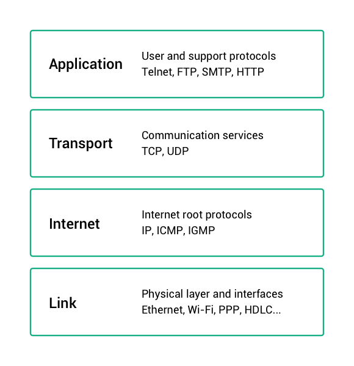
</div>

---
### Internet is a set of network protocols

### The Web is an abstract application on top of it
---
<!-- .slide: data-background="assets/the-web.jpg" -->
---
# The web
---
### Who's that guy?

<div>
  
</div>
---

<div>
  
</div>

### [Tim Berners-Lee](https://en.wikipedia.org/wiki/Tim_Berners-Lee)

English engineer and computer scientist — CERN researcher
---

## 🧑‍🔬 ✉️ 📡 📞 📬 🧑‍🔬 🤯

Berners-Lee observed how hard it was to share information among researchers — Especially pointing publications related to common topics

---

<div>
  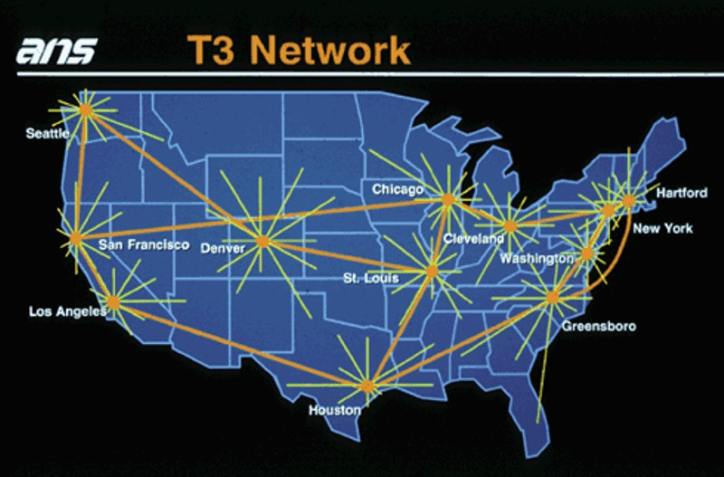
</div>

In 1991, the network was growing, expanding possibilities

<a class="source_link" target="_blank"
href="https://en.wikipedia.org/wiki/National_Science_Foundation_Network">
National Science Foundation Network
</a>
<a class="source_link" target="_blank"
href="https://www.computerhistory.org/internethistory/1990s/">
Internet History of 1990s
</a>

---
<!-- .slide: data-background="assets/internet_1993.gif" -->
---

World wide messaging was existing

<div>
  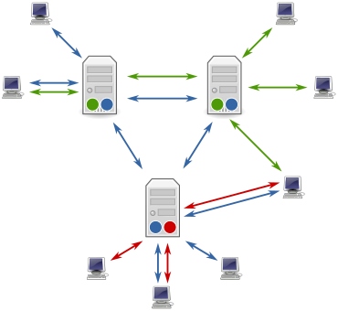
</div>

<a class="source_link" target="_blank"
href="https://en.wikipedia.org/wiki/Usenet">
Usenet since 1980
</a>

---
## But 
---
## Silo effect

Communication over interconnected networks was hard and not human friendly — No central place where knowledge could be shared.
---
## Berners-Lee's vision?
---
# 🕸
---
<div>
  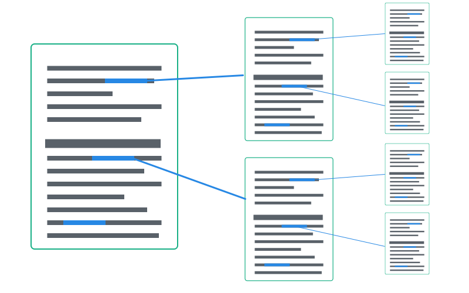
</div>
---
## The web — a suite of tools
---
### HTTP
<div>
  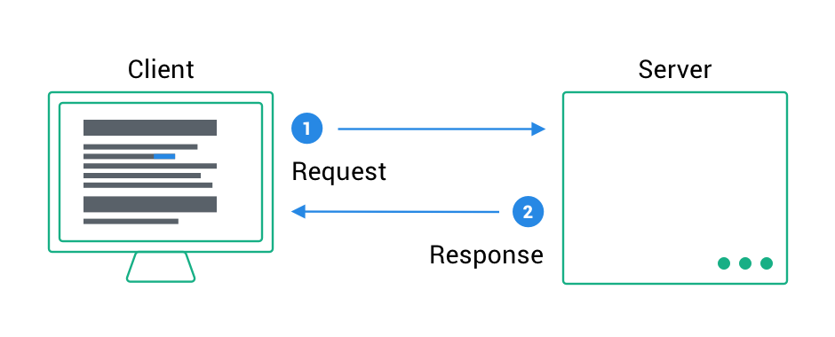
</div>
<a class="source_link" target="_blank"
href="https://en.wikipedia.org/wiki/Hypertext_Transfer_Protocol">
HTTP Wikipedia
</a>
---
### DNS

www.google.com

<div>
  
</div>
<a class="source_link" target="_blank"
href="https://en.wikipedia.org/wiki/Domain_Name_System">
DNS wikipedia
</a>
---
### Browsers
<div>
  
</div>
---
<code class="large">
  HTML / CSS / JS
</code>

<a class="source_link" target="_blank"
href="https://developer.mozilla.org/en-US/docs/Web/HTML">
HTML MDN
</a>
---

# HTML

## The web building blocks
---

<!-- .slide: data-background="assets/matrix_code.gif" -->

# 👇

<h2 style="color: #FFF;">cmd/ctrl + alt + I</h2>
---

### HTML is a markup language based on XML

[Extensible Markup Language (XML)](https://en.wikipedia.org/wiki/XML)

---
### It's all about boxes containing boxes

<div>
  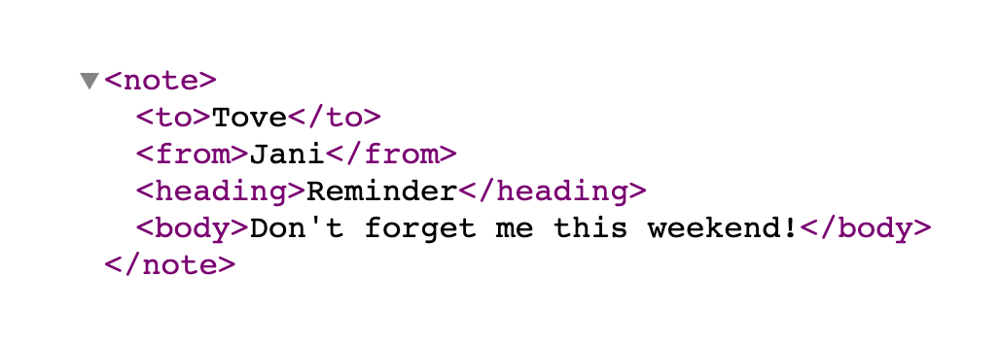
</div>
---

### HTML Element Structure

<div class="markup">
  <pre>&lt;</pre><span class="markup__tagname">tag</span> <br>
  &nbsp;&nbsp;<span class="markup__attribute">attribute</span><span>="value"</span><br>
  <pre>&gt;</pre><br>
  &nbsp;&nbsp;<span class="markup__content">Content?</span><br>
  <pre>&lt;/</pre><span class="markup__tagname">tag</span><pre>&gt;</pre><br>
</div>

---

### Common HTML elements

```html
<html>Document root</html>
<head>Document meta header</head>
<body>Page content</body>
<div>Default container</div>
<h1>Heading 1</h1>...<h6>Heading 6</h6>
<p>Paragraph</p>
<a>HyperText link</a>
<form>Form of user inputs</form>
<header>Header component</header>
<footer>Footer component</footer>
<nav>Containing navigation items</nav>
...
```

<a class="source_link" target="_blank"
href="https://developer.mozilla.org/en-US/docs/Web/HTML/Element">
HTML Elements - MDN
</a>

---
### Elements display
<div>
  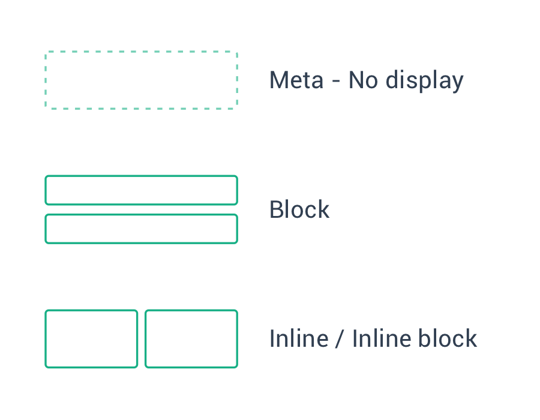
</div>
---
<iframe
  class="codesandbox"
  src="https://codesandbox.io/embed/html-displays-m99h3?fontsize=14&hidenavigation=1&theme=dark"
  title="html-basis"
  allow="geolocation; microphone; camera; midi; vr; accelerometer; gyroscope; payment; ambient-light-sensor; encrypted-media; usb"
  sandbox="allow-modals allow-forms allow-popups allow-scripts allow-same-origin"
></iframe>
---
### HTML 1, 2, 3, 4, 5...

#### Doctype

```html
HTML 5
<!DOCTYPE html>

HTML 4.01
<!DOCTYPE HTML PUBLIC "-//W3C//DTD HTML 4.01//EN"
"http://www.w3.org/TR/html4/strict.dtd">
```

---
### HTML5 minimal page

```html
<!DOCTYPE html>
<html>
    <head>
        <meta charset="utf-8" />
        <title>Titre</title>
    </head>

    <body>
    </body>
</html>
```
---
## 👷
### Let's type some code
---
<iframe
  class="codesandbox"
  src="https://codesandbox.io/embed/sleepy-edison-jeq14?autoresize=1&fontsize=14&hidenavigation=1&theme=dark"
  title="html-basis"
  allow="geolocation; microphone; camera; midi; vr; accelerometer; gyroscope; payment; ambient-light-sensor; encrypted-media; usb"
  sandbox="allow-modals allow-forms allow-popups allow-scripts allow-same-origin"
></iframe>

Note:
Build basic information display of article (Title, p, image)
---
## How to dive into the docs?
[Mozilla Developer Network (MDN) — HTML documentation](https://developer.mozilla.org/en-US/docs/Web/HTML)
---
# ✋
### Ok, but all this looks pretty ugly right?
---
How to get from
<div>
  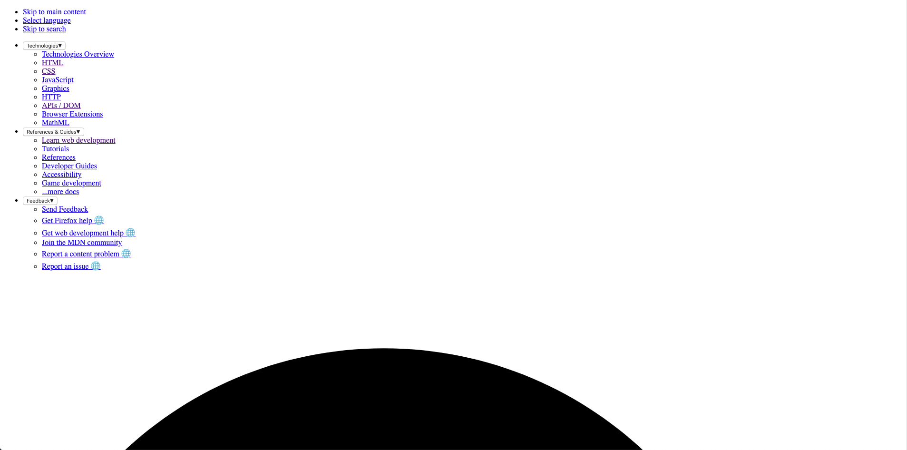
</div>
---
To
<div>
  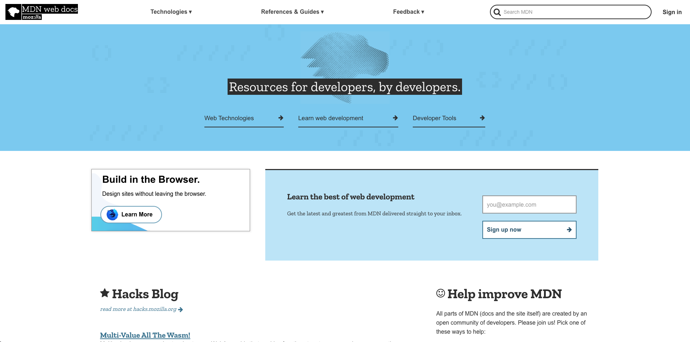
</div>
---

# HTML ❤️ CSS

```html
<link href="styles/style.css" rel="stylesheet">
```
---

## CSS

[Cascading Style Sheet](https://developer.mozilla.org/en-US/docs/Web/CSS)

```css
p {
  color: red;
}
.title {
  font-style: 2rem;
}
```
---

### Selectors

```html
<body>
    <p class="someClass">
        <span id="someIdentifier">Foo</span>
    </p>
    <p class="someClass">Bar</p>
</body>
```

```css
/* HTML tags: tag selector */
body { margin: 0 }

/* HTML class attribute: class selector */
.someClass { color: blue; }

/* HTML id attribute: id selector */
#someIdentifier { font-size: 8rem; }
```
---

### Properties

```css
p {
  display: block;
  color: #000;
  font-family: "Helvetica", "Arial", sans-serif;
  border: none;
  font-style: normal;
  font-size: 1rem;
  font-weight: bold;
  line-height: 1.3em;
  /* ... */
}
```

[CSS Reference](https://developer.mozilla.org/en-US/docs/Web/CSS/Reference)
---
### Pseudo-selectors

```html
<a class="someLink" href="/any">Some link</a>
```

```css
.someLink { color: white; }
.someLink:hover { color: black; }
.someLink:active { color: blue; }
.someLink:visited { color: blue; }
```

[Pseudo-class docs](https://developer.mozilla.org/en-US/docs/Web/CSS/Pseudo-classes)
---

<iframe
  class="codesandbox"
  src="https://codesandbox.io/embed/html-css-basis-ee5d0?fontsize=14&hidenavigation=1&theme=dark"
  title="html-css-basis"
  allow="geolocation; microphone; camera; midi; vr; accelerometer; gyroscope; payment; ambient-light-sensor; encrypted-media; usb"
  sandbox="allow-modals allow-forms allow-popups allow-scripts allow-same-origin"
></iframe>

Note:
Flux Display /Inheritance / selector depth
---
## Think in boxes 👉
---
<div>
  
</div>
---
<div>
  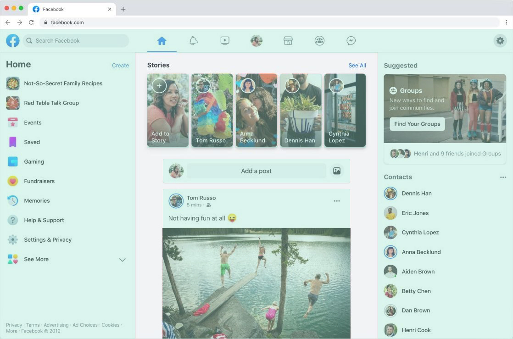
</div>
---
<div>
  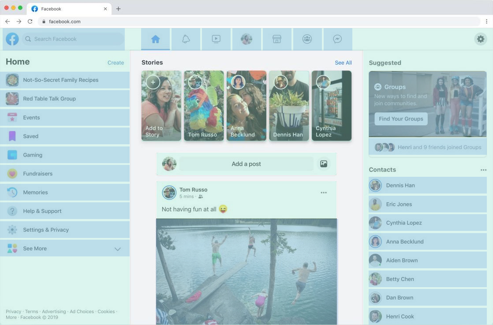
</div>
---

# 🎨
## Design to code

---
<div>
  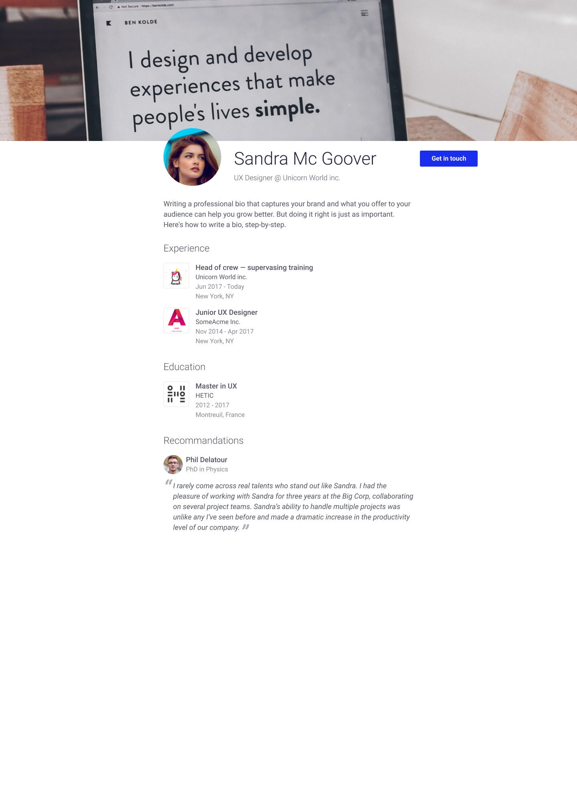
</div>
---
<div>
  
</div>
---
<iframe class="figma" src="https://www.figma.com/embed?embed_host=share&url=https%3A%2F%2Fwww.figma.com%2Ffile%2FimpVe29Fh49HCzcxiyGNVJ%2FHETIC-MM4-2019-HTML-CSS%3Fnode-id%3D0%253A1" allowfullscreen></iframe>
---
<iframe
  class="codesandbox"
  src="https://codesandbox.io/embed/hetic-mm4-profile-exercise-nxkc7?fontsize=14&hidenavigation=1&theme=dark"
  title="hetic-mm4-profile-exercise"
  allow="geolocation; microphone; camera; midi; vr; accelerometer; gyroscope; payment; ambient-light-sensor; encrypted-media; usb"
  sandbox="allow-modals allow-forms allow-popups allow-scripts allow-same-origin"
></iframe>
---

# Resources

---

# 🛠
## Dev tools

---
<div>
  
</div>

## VS Code

Simple code editor

[https://code.visualstudio.com/download](https://code.visualstudio.com/download)

---
<div>
  
</div>

## NodeJS

Javascript runner

[https://nodejs.org/en/download/](https://nodejs.org/en/download/)

---
<div>
  
</div>

## Terminal

```bash
$ node -v
$ npm -v
```
---
<div>
  
</div>

## Code Sandbox

Collaborative online editor

[https://codesandbox.io/](https://codesandbox.io/)

---
<div>
  
</div>

### Can I use?

[caniuse.com](https://caniuse.com)

---

## That's all folks

Thank you
