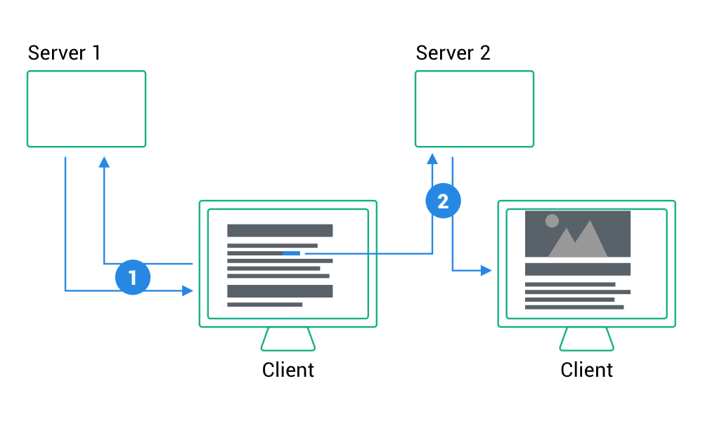
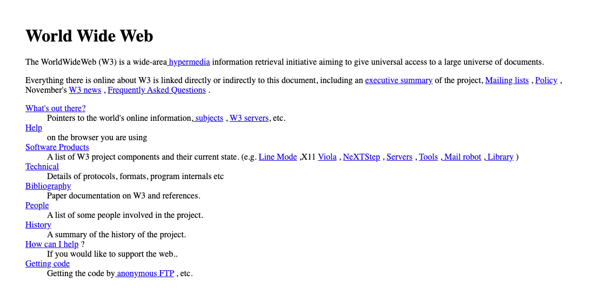
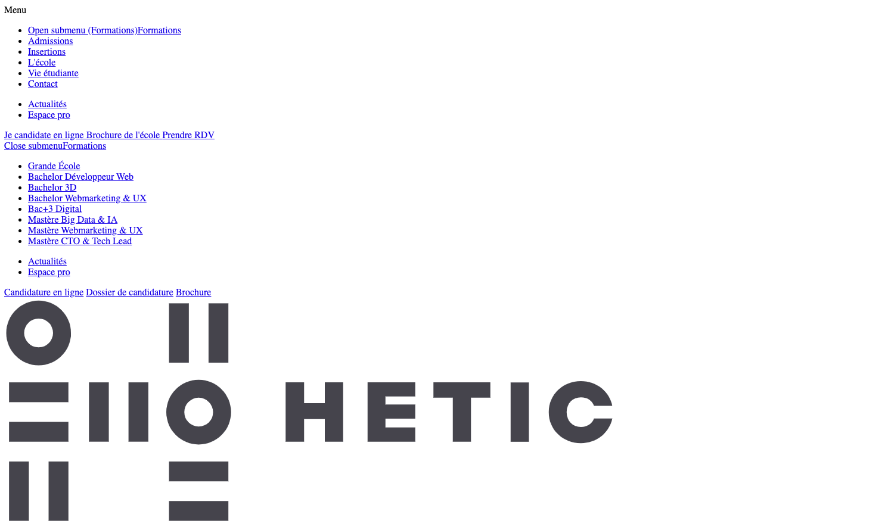

## MM4

# HTML / CSS

<a target="_blank" style="font-size: 24px; margin-top: 80px; display: block;" href="https://nclsndr.github.io/hetic-html-css-mm4-2019/#/">nclsndr.github.io/hetic-html-css-mm4-2019</a>

---

## Who am I?

- [Nicolas André](https://twitter.com/nclsndr) — UX Engineer at <a target="_blank" href="https://www.chance.co">Chance</a>

---

# And you?

---

## About this cycle

26 nov. <br>
[Internet](#/8) - [The Web](#/25) - [HTML](#/34) - [CSS](#/45) <br>
03 dec. <br>
10 dec. <br>
Sandboxes: [Basis](#/41)
---

<h1 style="color: #FFF;">Ready?</h1>

<!-- .slide: data-background="assets/ready.gif" -->

---

# 🧐

### Who is HTML?

---

### Some valid definition 

by [Mozilla docs](https://developer.mozilla.org/en-US/docs/Web/HTML)

__HTML__ (HyperText Markup Language) is the most basic building block of the Web. It defines the meaning and structure of web content. [...]

---

# 🤷‍♀️
### Ok, but why?

---

<h2 style="color: #FFF;">Back in 1969</h2>

<!-- .slide: data-background="https://media.giphy.com/media/3o7aD46cTjbkp0gT5e/giphy.gif" -->
---

<div>
  
</div>

### 🇺🇸 👮‍♀️ 💬 ☢️ 💬 👨‍💼
---


[Defense Advanced Research Projects Agency](https://www.darpa.mil/about-us/about-darpa) — since 1958
---
<div>
  
</div>

## SRI
[Stanford Research Institute](https://en.wikipedia.org/wiki/SRI_International) — since 1946

---
<div>
  
</div>

### [Douglas Engelbart](https://en.wikipedia.org/wiki/Douglas_Engelbart)

American engineer and inventor, and early computer and Internet pioneer

Founder of Augmentation Research Center (ARC) at SRI

---
<div>
  
  
</div>
<div>
  
  
</div>

### 🧑‍🏫 📺 💬 📺 🧑‍🏫

Note:
https://www.lib.utah.edu/digital-scholarship/arpanet/
https://en.wikibooks.org/wiki/The_Computer_Revolution/Networks/Internet

---
> The goal was to exploit new computer technologies to meet the needs of military command and control against nuclear threats, achieve survivable control of US nuclear forces, and improve military tactical and management decision making.

*— [Stephen J. Lukasik](https://en.wikipedia.org/wiki/ARPANET#Debate_on_design_goals), Director of DARPA (1967–1974)*

---
> The ARPANET was not started to create a Command and Control System that would survive a nuclear attack, as many now claim. [...]. Rather, the ARPANET came out of our frustration that there were only a limited number of large, powerful research computers in the country, and that many research investigators, who should have access to them, were geographically separated from them.

*— [Charles Herzfeld](https://en.wikipedia.org/wiki/ARPANET#Debate_on_design_goals), ARPA Director (1965–1967)*

---
### [Request For Comments](https://tools.ietf.org/html/rfc1)

<div>
  
</div>

Applying scientific method for a collaborative definition of protocols

---
<div>
  
</div>

1969
---
<div>
  
</div>

1970
---
<div>
  
</div>

1973 - [source: vox.com](https://www.vox.com/a/internet-maps)
---
<!-- .slide: data-background="assets/twitter_wake_up.gif" -->
---

## Internet VS Web?

---

### RFC1122 - Internet Protocol Suite

<div>
  
</div>

---
### Internet is a set of network protocols

### The Web is an abstract application on top of it
---
<!-- .slide: data-background="assets/the-web.jpg" -->
---
# The web
---
### Who's that guy?

<div>
  
</div>
---

<div>
  
</div>

### [Tim Berners-Lee](https://en.wikipedia.org/wiki/Tim_Berners-Lee)

English engineer and computer scientist — CERN researcher
---

## 🧑‍🔬 ✉️ 📡 📞 📬 🧑‍🔬 🤯

Berners-Lee observed how hard it was to share information amoung researches — Especially linking articles

---
## His solution?
---
<code class="large">
  HyperText Markup Language
</code>

<div>
  
</div>
---
### Ok, but IRL it looks more like 👉
---
<div>
  
</div>
---
<h1 style="color: #FFF;">But that's another story...</h1>
<!-- .slide: data-background="assets/close_curtain.gif" -->
---

# HTML

## The web building block
---
<div>
  
</div>
---
<!-- .slide: data-background="assets/matrix_code.gif" -->

# 👇
---

### HTML is a markup language based on XML

[Extensible Markup Language (XML)](https://en.wikipedia.org/wiki/XML)

---
<div>
  
</div>
---

### HTML Element

<div class="markup">
  <pre>&lt;</pre><span class="markup__tagname">tag</span> <br>
  <span class="markup__attribute">attribute</span><span>="value"</span><br>
  <pre>&gt;</pre><br>
  <span class="markup__content">Content?</span><br>
  <pre>&lt;/</pre><span class="markup__tagname">tag</span><pre>&gt;</pre><br>
</div>

---

### Common HTML tags

```html
<html>Document root</html>
<head>Document meta header</head>
<body>Page content</body>
<div>Default container</div>
<h1>Heading 1</h1>...<h6>Heading 6</h6>
<p>Paragraph</p>
<a>HyperText link</a>
<form>Form of user inputs</form>
<header>Header component</header>
<footer>Footer component</footer>
<nav>Containing navigation items</nav>
...
```

---
<iframe
  class="codesandbox"
  src="https://codesandbox.io/embed/sleepy-edison-jeq14?autoresize=1&fontsize=14&hidenavigation=1&theme=dark"
  title="html-basis"
  allow="geolocation; microphone; camera; midi; vr; accelerometer; gyroscope; payment; ambient-light-sensor; encrypted-media; usb"
  sandbox="allow-modals allow-forms allow-popups allow-scripts allow-same-origin"
></iframe>
---
# ✋
### Ok, but all this looks pretty ugly right?
---
How to get from
<div>
  
</div>
---
To
<div>
  
</div>
---

# HTML ❤️ CSS

---

## CSS

```css
p {
  color: red;
}
```

[Cascading Style Sheet](https://developer.mozilla.org/en-US/docs/Web/CSS)

---

---
<div>
  
</div>
---
<div>
  
</div>
---
<div>
  
</div>
---

## Ressources

---

## That's all folks

Thank you
